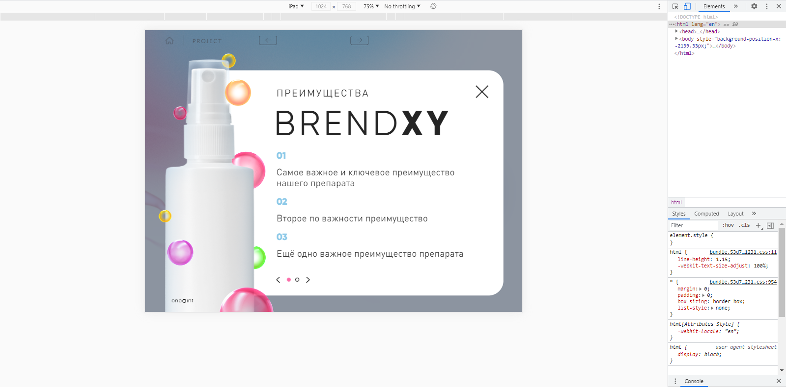

# onpoint тестовое задание Frontend  
Приложение реализовано в виде страницы с горизонтальной ориентацией. По слайдам перемещение осуществляется с помощью горизонтального свайпа и ссылок. На втором слайде текст прокручивается ползунком.

Использован React  
Сборка webpack. В директории для запуска консольные команды  
"npm install" и "npm start"/"npm run dev"/"npm run build"

Скриншоты

